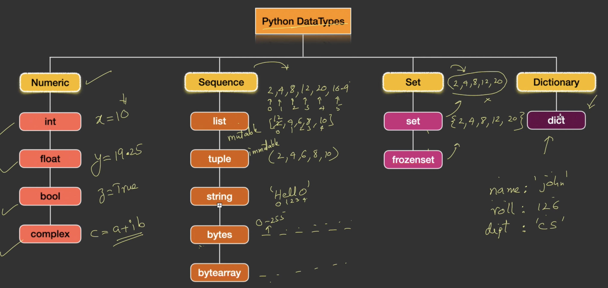
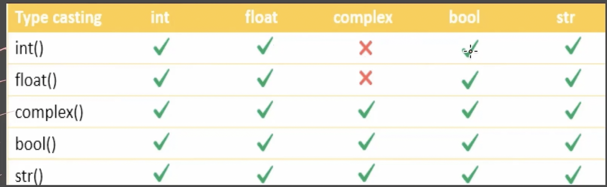

## How a python program runs ?
- Program.py (source code) -> Compiler -> Program.pyc (ByteCode) -> Interpreter -> Converts to Machine Code -> Python Virtual Machine
- Having the source code converted into ByteCode(error free code) reduces the burden on Interpreter.
- Python Platform Independent/Portable
- Same file .pyc can be run on various operating system if PVM is availaible.

## Features of Python
- Simple/Expressive
- Easy to learn
- Scripting Language
- Open Source
- Platform Independent
- Procedural & Object Oriented
- Huge library
- Embeddable
- Scalable

## Variables
- Declaration and initialization is done together.
- Variables do not have specific data type , it's type depends on the value assigned to it.
- type(x) -> <class 'str'>

### Rules for Declaring a variable name
- Name can contains alpha-numeric characters & underscore.
- Name should start with a letter or underscore character.
- Variables are case-sensitive.

## Python Data Types


- Numeric DataTypes
    - There is no size limit or there is no range for integer, like how we have for other languages like c++.
    - There is no fixed size memory taken by any data type in Python.
    - eg: 12.5 can be represented as 125E-1
- Bool
    - In case of true t should be capital in case of false f should be capital.
    - true represents numeric value 1 whereas false represent numeric value 0.
- Complex
    - eg 4 + 5j can be represented as complex(4, 5)

## Base - conversion
- bin()
- oct()
- hex()
```
eg: a = 10
bin(a) => '0b1010'
```

## Type Conversion
- converting data type from one to another.
 - int()
 - float()
 - complex()
 - bool()
 - str()
 

## is or is not operator
- They will check whether both the variabes are holding onto the same memory.
```
eg: 
a = 10
b = 10
res = a is b //True
```

## range
- range(start, end, step)
- range goes from start to end-1 and steps according to step

## Match Case
- works like if else
```
day = int(input("Enter day number"))
match day:
    case 1:
        print("Sunday")
    case 2: 
        print("monday")
    case _:
        print("holiday")
```

## String and Its Methods
- s1 = [ h  e  l  l  o]
- s1 = [h (0) , e (1), l(2), l(3), 0(4)]
- s1 = [h (-5) , e (-4), l(-3), l(-2), 0(-1)]
- s1 typeof(s1) => ```<class 'str'>```
- len : gives len of a string
- s1 = "john's"

### Operators on String
- 1. concatentation
    ```
        s1 = "hello"
        s2 = " world"
        s3 = s1 + s2 //"hello world"
    ```
- 2. Repetition
    ```
        s1 = "hello"
        s1 = s1 * 2 //"hello hello"
    ```
- 3. Indexing
    - In string index can be done from behind as well -1, -2, ... so on
    ```
    s1 = "hello world"
    for i in range(0, len(s1)):
        print(s1[i])
    ```
- 4. Slicing Operator: ```s1[start:end:step]```

    ```
    s2[::-1] //elloh
    ```
- 5. in (checks whether string is member in string of s1)
```eg : 'h' in s1```

- 6. not in
```eg: 'he' not in s1```

### 